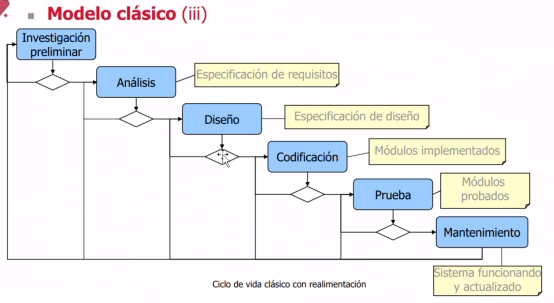
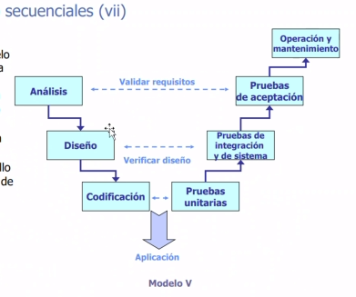

# 📘 Clase 03

| Metodologías Tradicionales | Metodologias Ágiles |
|----------------------------|---------------------|
| Basadas en normas provenientes de estándares seguidos por el entorno de desarrollo | Basadas en heurísticas provenientes de prácticas de producción de código |
| Cierta resistencia a los cambios | Especialmente preparadas para cambios durante el proyecto |
| Impuestas externamente | Impuestas internamente (por el equipo) |
| Proceso mucho más controlado, con numerosas políticas/normas | Proceso menos controlado, con pocos principios |
| El cliente interactúa | El cliente es parte del equipo de desarrollo |
| Más artefactos | Pocos artefactos |
| Más roles | Pocos roles |

## Extra
- Productos pequeños no necesitan tanto escenario.
- En proyectos grandes se necesita documentación, roles, etc.

Las metodologías tradicionales crean roles y fases, lo que ayuda a madurar temas. Aquí nacen roles como senior, junior, QA, analistas, entre otros.

| Tradicionales | Ágiles |
|---------------|--------|
| Hay productos que necesitan de un rol | Es indiferente en los roles; esto sirve en proyectos pequeños |
| Grupo más grande | Pocos integrantes |
| La arquitectura es esencial y se expresa mediante modelos | Menos énfasis en la arquitectura de software |
| Existe un contrato prefijado con objetivos claramente delimitados | No existe contrato tradicional o es bastante flexible |
| | Si no se piensa en escalabilidad, se debe reescribir o rehacer el producto |

# Proceso de desarrollo de software

¿En qué consiste el proceso de desarrollo de software?

El desarrollo de software consiste en múltiples actividades:
- Ingeniería y análisis de sistemas
- Análisis de los requisitos: encargado de obtener los requerimientos
- Diseño
- Codificación
- Prueba
- Mantenimiento

Clasificación de los modelos de software:
- Modelos tradicionales
  - Clásico, lineal o en cascada
  - Estructurado
  - Basado en prototipos 
  - Desarrollo rápido de aplicaciones (RAD)
- Modelos evolutivos
  - Incremental
  - Iterativo
  - En espiral
- Modelos para sistemas orientados a objetos
  - De agrupamientos
  - Proceso unificado
- Modelos basados en reutilización 
  - Basado en componentes
  - Proceso unificado
- Procesos ágiles
  - Programación 
- Modelos para sistemas web

## Modelo primitivo
- También conocido como Modelo Prueba y Error o Modelo Codifica y Mejora.
- Proceso de desarrollo aplicado en las primeras experiencias de programación.
- Supone una iteración de fases codificación-depuración sin ninguna planificación ni diseños previos.

### Modelo primitivo - Inconvenientes
Este modelo puede resultar poco eficiente y propenso a errores al carecer de una estructura clara, lo que puede generar problemas de mantenimiento y escalabilidad en proyectos complejos.

## Modelos lineales o secuenciales
- Han sido ampliamente utilizados
  - Ofrecen grandes facilidades a los gestores para controlar el progreso de los proyectos
  - Proponen un enfoque sistemático, secuencial, para el desarrollo del software
  - Comienza en un nivel de sistemas y progresa con el análisis, diseño, codificación, pruebas y mantenimiento.
  - Fases separadas en la especificación y el desarrollo
- La filosofía

### Modelo clásico
También conocido como modelo lineal o en cascada.

- Inconvenientes
Este modelo puede resultar rígido, dificultando la adaptación a cambios y requerimientos que surjan durante el desarrollo.

### Modelo en V
Es una variación de la cascada.

Este modelo amplía el concepto de prueba desde las primeras etapas del desarrollo, lo que reduce riesgos, pero puede incrementar la complejidad y costos.

## Modelo basado en prototipos
Un prototipo es un modelo experimental de un sistema o de un componente de un sistema que tiene los suficientes elementos que permiten su uso.
- Objetivos
  - Son un medio eficaz para aclarar los requisitos de los usuarios e identificar las características de un sistema que deben cambiarse o añadirse.
  - Mediante el prototipo se puede verificar la viabilidad del diseño de un sistema
- Características
  - Es una aplicación que funciona
  - Su finalidad es probar varias suposiciones con respecto a las características
  - Se crean con rapidez
  - Evolucionan a través de un proceso iterativo
  - Tienen un costo bajo de desarrollo
