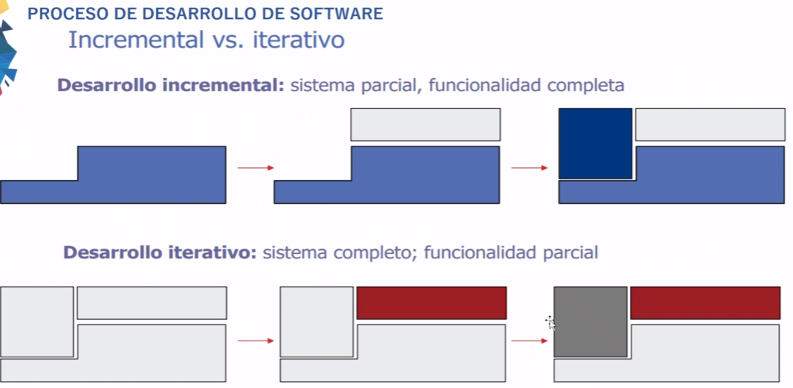

# Clase 05
## Desarrollo Rápido de Aplicaciones 

En Sistemas de Información automatizados, el desarrollo comprende las fases:

- Modelado de Gestión
- Modelado de Datos
- Modelado de Proceso
- Generación de Aplicaciones
- Pruebas y Entrega

Los modelos evolutivos en el software, como sistemas complejos, evolucionan con el tiempo. En los orientados a objetos, se ajustan a un modelo iterativo e incremental.

### Modelo Incremental
El sistema se divide en subsistemas según su funcionalidad.

### Modelo Iterativo
Entrega el sistema completo desde el principio.

Los modelos en espiral, propuestos por B. Boehm, son procesos evolutivos que ofrecen potencial.

### Modelo Win-Win
Extiende el modelo en espiral, enfocándose en el éxito mutuo de todas las partes involucradas.

Ventajas:
- Refleja la realidad del desarrollo de software.
- Combina lo mejor de otros modelos según la situación.
- Considera la reutilización desde el inicio.
- Prepara para la evolución y cambio.
- Incorpora objetivos de calidad desde el inicio.
- Elimina errores y opciones no atractivas de inmediato.
- Determina el esfuerzo en cada fase de cada proyecto.
- Sigue un procedimiento consistente para desarrollo y mantenimiento.
- Ofrece gran flexibilidad.
- Se adapta bien al diseño y programación orientados a objetos.

Los modelos para sistemas orientados a objetos surgieron debido a la dificultad de adaptar modelos tradicionales a ellos.

Características:
- Eliminación de fronteras entre fases.
- Uso de componentes reutilizables.
- Alto grado de iteratividad y superposición.
- Desarrollo incremental.

## Proceso Unificado

Definido por Rational Software Corporation.

Características:
- Conducido por casos de uso.
- Centrado en la arquitectura.
- Iterativo e incremental.

El proceso unificado repite ciclos:
- Inicio
- Elaboración
- Construcción
- Transición

## Metodología, Método y Ciclo de Vida del Software

Desde una perspectiva de Ingeniería de Software, una metodología describe métodos, técnicas y actividades con un enfoque sistémico.

Una metodología puede seguir uno o varios modelos de ciclo de vida, los cuales indican lo que se debe obtener a lo largo del desarrollo del proyecto.

## Metodología de Software

- Proceso del ciclo de vida completo, aspectos del negocio y técnicos.
- Conjunto completo de conceptos y modelos consistentes internamente.
- Colección de reglas, guías y descripciones de artefactos.
- Notación con soporte de herramientas CASE y diseño para usabilidad óptima.
- Conjunto de técnicas probadas, métricas y asesoramiento en calidad y pruebas.
- Identificación de roles organizacionales.
- Guías para gestión de proyectos y aseguramiento de calidad.

## Metodologías Estructuradas

Pasan de una visión general del problema a un nivel de abstracción sencillo, enfocándose en el sistema funcional o en la estructura de datos.

### Metodologías Estructuradas Orientadas a Procesos

Representantes: Merise, YSM, SSADM, METRICA.
Proponen la creación de modelos descendentes - secuenciales del sistema.

### Metodologías Orientadas a Objetos

Se basan en la integración de datos y procesos para un modelado cercano al mundo real.

## Paradigmas del desarrollo: Metodologias Agiles, Team Foundation Server y CMM
Vision tradicional: Metodologías pesadas
- Metrica 3
- Ciclo de vida: cascada
- Rigurosa y poco flexibles
- Orientada a proyectos grandes y complejos
- Mucha documentacion

Nuevos paradigmas: Metodologias ligeras
- CMMI
- VS2010
- MSF-Agile
- MSF-CMMI

Metodologia agiles
- Manifiesto agil
- XP, SCRUM
- Ciclo de vida: iterativo incremental
- Adaptacion al cambio
- Poca documentacion

