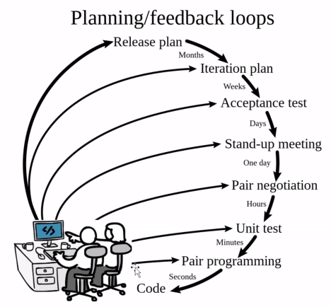

# Metodologias de software
## Metodologia agiles
La agilidad significa respuesta efectiva al cambio, pero incluye:
- Estructuras de equipo y actitudes para facilitar la comunicacion entre los miembros.
- Enfasis en la entrega rápida de software funcional.
- Adopción del cliente como parte del equipo de desarrollo.
- Planificacion incierta y, por tanto, flexible.

Mitos:
1. Agile significa que no hay planeacion: La planificacion se desarrolla continuamente
2. No necesita documentacion: Agile no es excusa para omitir la documentacion
3. Solo funciona con pequeños proyectos: En proyectos grandes, se pueden organizar múltiples equipos
4. Agile = SCRUM: Scrum es un marco para el desarrollo y la gestion del trabajo, mientras que Agile es un enfoque que sigue un conjunto comun de valores y principios
5. Implementar Agile es facil: Los equipos de proyecto deben aprender las mejores practicas de Agile y tambien comprender las circunstancias especificas
6. No existe disciplina en agile: Para conseguir proyectos exitosos con Agile se requiere habilidad, coordinacion, colaboracion y disciplina
7. Agile es solo para desarrollo de software: Agile no es solo para los desarrolladores. Es para todo aquel que desee generar una lluvia de ideas, modelar, desarrollar y colaborar
8. Agile es falta de control

Manifiesto agil es un documento fundamental en el campo del desarrollo de software que establece los valores y principio clave de las metodologias agiles.

El manifiesto agil
---
### Analogia
Las metodologias de software ayudan a lograr la calidad de software
¿Puedo lograr la calidad del software sin usar metodologias?

Ejemplo: necesito hacer un nudo de corbata y no tengo idea de como hacerlo...

¿Como podria resolver el problema?
- La solucion mas facil es realizar outsorcing(que lo hagan otros)

Sino se puede, se deberá reañozar en base a atres formas basicas de solucion de problemas:
- Conocimiento
- Experiencia
- Sentido comun

Laa forma mas facil es a traves de una metodologia para realizar nudos de corbatas como la planteada en nudo-de-corbata.com

Lo primero que se tiene que saber es si debe ser un tipo especial de corbata o no
Los tipos pueden ir desde nudo de corbata simple, doble, windsor, medio windsor, nudo pequeño

## Procesos agiles
Constituyen un nuevo enfoque en el desarrollo del software cuyas principales caracteristicas son:
- Menor enfasis en el analisis, diseño y documentacion
- Equipos pequeños
- Desarrollo incremental
- Programacion(plnificacion temporal) en cajas de tiempo
- Supervivencia en un entrono caotico

Diversos enfoques
- XP (eXtreme Programming)
- Scrum
- Crystal
- Proceso Software Adaptativo
- Proceso Unificado Agil

Cualquiera que fuera el metodo agil debe de cumplir con el manifiesto agil
Scrum es certificable mientras que XP no lo es, pero muchos equipos de desarrollo la manejan ampliamente

Critica: no salir al mercado a lo bruto

### XP
Convertido enfoque de desarrollo de software basado en el modelo incremental
Esta indicado para:
- Equipos de tamaño mediano o pequeño
- Requisitos imprecisos y cambiantes caracteristicas
- El juego de la planificacion
- Versiones pequeñas
- Metafora
- Diseño sencillo
- Hacer pruebas
- Refactorizacion
- Programacion en parejas
- Propiedad colectiva
- Integracion continua
- Cliente in-situ
- Estandares de codificacion

